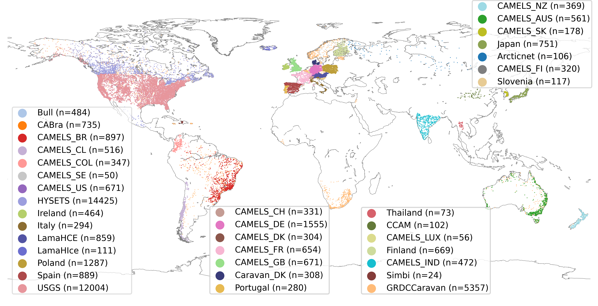

# Summary 
AquaFetch is a Python package designed for the automated downloading, parsing, cleaning, and harmonization of freely available water resource datasets related to rainfall-runoff processes, surface water quality, and wastewater treatment. The package currently supports 70 datasets, downloading and transforming raw data into consistent, easy-to-use analysis-ready data. This allows users to directly access and utilize the data without labor-intensive and time-consuming preprocessing.

The package comprises three submodules, each representing a different type of water resource data: `rr` for rainfall-runoff processes, `wq` for surface water quality, and `wwt` for wastewater treatment. The rr submodule offers data for 47,291 catchments from 36 sources worldwide, encompassing both dynamic and static features for each catchment (\autoref{fig1}). The dynamic features consist of observed streamflow and meteorological time series, averaged over the catchment area, available at daily or hourly time steps. Static features include constant parameters such as land use, soil, topography, and other physiographical characteristics in tabular format, along with catchment boundaries as shapefiles. This submodule not only provides access to established rainfall-runoff datasets such as CAMELS [@camels_addor_2017] and LamaH [@lamahce_klingler] but also introduces 10 new datasets compiled for the first time from publicly accessible online data sources. The `wq` submodule offers access to 16 surface water quality datasets, each containing various water quality parameters measured across different spaces and times (\autoref{fig2}). The `wwt` submodule provides access to 22,471 experimental measurements related to wastewater treatment techniques such as adsorption, photocatalysis, and sonolysis.

The development of AquaFetch was inspired by the growing availability of diverse water resource datasets in recent years. As a community-driven project, the codebase is structured to allow contributors to easily add new datasets, ensuring the package continues to expand and evolve to meet future needs.


# Statement of need
The rapid increase in publicly available spatio-temporal datasets in various domains, including water resources, is mainly driven by advances in computation and storage as well as demand to develop accurate data-driven solutions for challenges like climate change, water scarcity, and environmental pollution. However, importing them into Python is cumbersome, requiring researchers to navigate multiple sources and handle inconsistent formats and units. Many datasets also need extensive preprocessing, making its acquisition a complex and skill-intensive task before it can be used for analysis or modeling.

These challenges highlight the need for a unified, consistent, automated, and reusable framework for extracting hydrological and environmental data. The AquaFetch package addresses this gap by leveraging data-handling tools such as Pandas [@Pandas], NumPy [@NumPy2020], xarray [@xarray2017], and netCDF4 [@NSF_Unidata_and_Davis_NetCDF-C] to offer a streamlined workflow for automatic data extraction from multiple sources in various formats.

Several other packages also aim to facilitate the acquisition and processing of water resource data. For example, tools like dataretrieval [@dataretrieval], hydrofunctions [@hydrofunctions], and harmonize-wq [@harmozie_wq] provide streamlined access to hydrological and water quality data, though they are primarily limited to data from U.S. Geological Survey (USGS) and Environmental Protection Agency (EPA) stations. Data Retriever [@retriever_Senyondo2017] offers access to over 200 parameters, including water quality, but lacks comprehensive rainfall-runoff datasets and wastewater treatment data. Meanwhile, tsp [@tsp] focuses on managing ground temperature data, and the HyRiver suite [@HyRiver] provides access to hydro-climate data exclusively from USGS’s National Water Information Service (NWIS). Geodata-Harvester [@GeodataHarvester] offers reusable and automated workflows for extracting diverse geospatial and environmental data for Australia.

The Caravan initiative [@Caravan] stands out as a global platform for hydro-meteorological data with a distinct focus. While it aims to create large-sample hydrology datasets globally, AquaFetch facilitates access to a broad range of data via a unified interface, including processed rainfall-runoff datasets from countries like Japan, Thailand, Ireland, and Poland --- regions not covered by Caravan. Additionally, Caravan emphasizes cloud-based processing using the proprietary Google Earth Engine and does not provide a standalone Python package, requiring users to upload catchment boundaries for extracting static features. This highlights the distinct operational focuses of Caravan and AquaFetch.

Ultimately, we hope this package will foster the development of benchmark datasets in hydrological and environmental sciences, enhancing the comparability and reproducibility of data-driven solutions for water resource management.



# Implementation and Architecture
The AquaFetch package is structured using both functional and Object-Oriented Programming (OOP) designs. The OOP design is employed for handling more complex datasets within the `rr` and `wq` submodules, while simpler datasets are managed through a functional interface. All datasets in the rr submodule can be accessed via the RainfallRunoff class, thus offering a unified interface. The package's code is logically organized, with `rr`, `wq`, and `wwt` subdirectories present in both the source code (aqua_fetch) and tests directories. All public classes and functions are accessible from the parent directory, allowing for straightforward imports as shown below:

```python
    from aqua_fetch import RainfallRunoff
    from aqua_fetch import SWatCh
    from aqua_fetch import mg_degradation
```

Datasets are downloaded upon the first call to the respective function or class. The data is saved locally and will not be redownloaded unless the user explicitly requests it to be overwritten. The package also leverages parallel processing to expedite the downloading and parsing of large datasets in the `rr` submodule, significantly speeding up data retrieval when multiple CPU cores are available.


# Testing and dependencies
The package's core dependencies include requests [@requests], NumPy, and Pandas. xarray is utilized for saving data in netCDF4 [@NSF_Unidata_and_Davis_NetCDF-C] format, which is efficient for handling large datasets; however, this step is an optional dependency. Other optional dependencies include Matplotlib [@matplotlib] for plotting and visualization, openpyxl [@openpyxl] for parsing Microsoft Excel files, along with Fiona [@fiona] for processing shapefiles.
Adhering to the 'unit test' protocol, comprehensive testing has been implemented for all data classes and functions. Since downloading the datasets is time-consuming, the tests are conducted offline under the assumption that the datasets are already downloaded. These unit tests verify the number and types of parameters returned by the data functions.

# Acknowledgements
For part of the analysis, we utilized the Shaheen~III supercomputer, managed by the Supercomputing Core Laboratory at King Abdullah University of Science and Technology (KAUST) in Thuwal, Saudi Arabia. Part of the research was supported by the KAUST/MEWA Strategic Partnership Agreement (SPA) for Water, under award numbers 6110 and 6111.

# References
